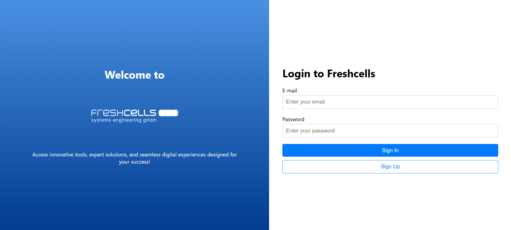
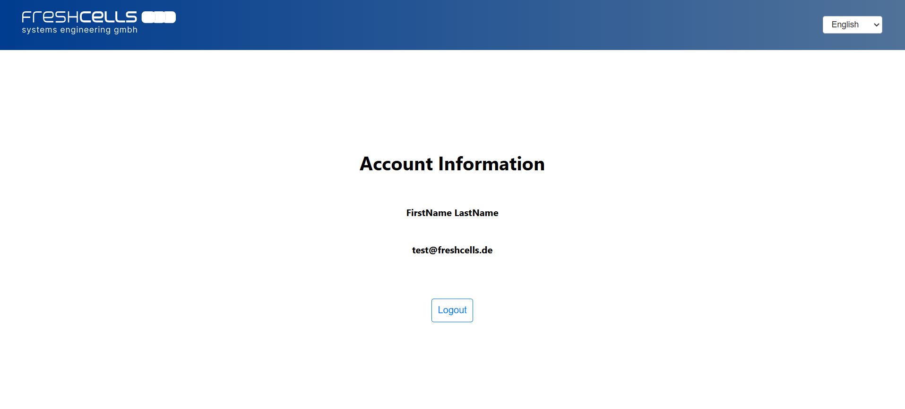

# Freshcells Trial Task

## Description

This is a simple React-based web application built as part of a fcse trial task. The project demonstrates the use of modern web development technologies like React, JavaScript, and GraphQL to create a minimal single-page application (SPA). It includes essential features like authentication, user details retrieval, and user session management. The application focuses on clean architecture, error handling, and responsive UI design to provide a smooth user experience.

The application connects to a GraphQL backend to authenticate users and fetch account details, showcasing the integration of frontend and backend through modern API protocols.

## Features

### Login Screen

- Includes fields for entering **email** and **password**.
- Validates input fields:
  - Email must match a valid email pattern.
  - Password is a required field.
- Submits credentials via a GraphQL mutation to authenticate the user.
- Handles errors gracefully, such as invalid credentials, by displaying appropriate feedback messages.
- On successful login, redirects the user to the account details screen.

### Account Screen

- Displays the logged-in user's **first name** and **last name** in non-editable fields.
- Fetches user data from the GraphQL endpoint using a query.
- Includes a **logout button** that:
  - Clears the user session.
  - Redirects back to the login screen.

### Session Management

- Maintains user login state.
- Logs out the user upon request, ensuring secure session handling.

### Error Handling

- Displays error messages for invalid login attempts.
- Handles uncaught errors to prevent application crashes.

### UX Enhancements

- Implements loading states during API interactions (e.g., while logging in or fetching user data).
- Provides error notifications for failed operations.

### Clean UI Design

- Minimalistic and responsive interface for an optimal user experience.
- Organized layout for seamless navigation.

### Optional Enhancements

- SPA navigation to ensure a smooth user experience.
- Localization support for multiple languages.
- Unit tests for key components to ensure functionality and reliability.

## How to Run the Project

### Prerequisites

- Ensure Node.js is installed (version >= 18.x recommended).
- Install a package manager like `npm` or `yarn`.
- Have internet access to connect to the GraphQL backend.

### Steps to Run

1. **Installing Dependencies**:

   - Run the following command to install all required packages:
     ```bash
     npm install (--force)
     ```
     or
     ```bash
     yarn
     ```

2. **Running the Project**:

   - Start the development server with:
     ```bash
     npm start
     ```
     or
     ```bash
     yarn start
     ```
   - The application will be accessible at `http://localhost:3000`.

## Technologies Used

- **ReactJS**: Frontend library for building the user interface.
- **GraphQL**: API for querying and mutating backend data.
- **JavaScript**: Core programming language for application logic.

## Testing

Run the following command to execute unit tests:

```bash
npm test
```

or

```bash
yarn test
```



